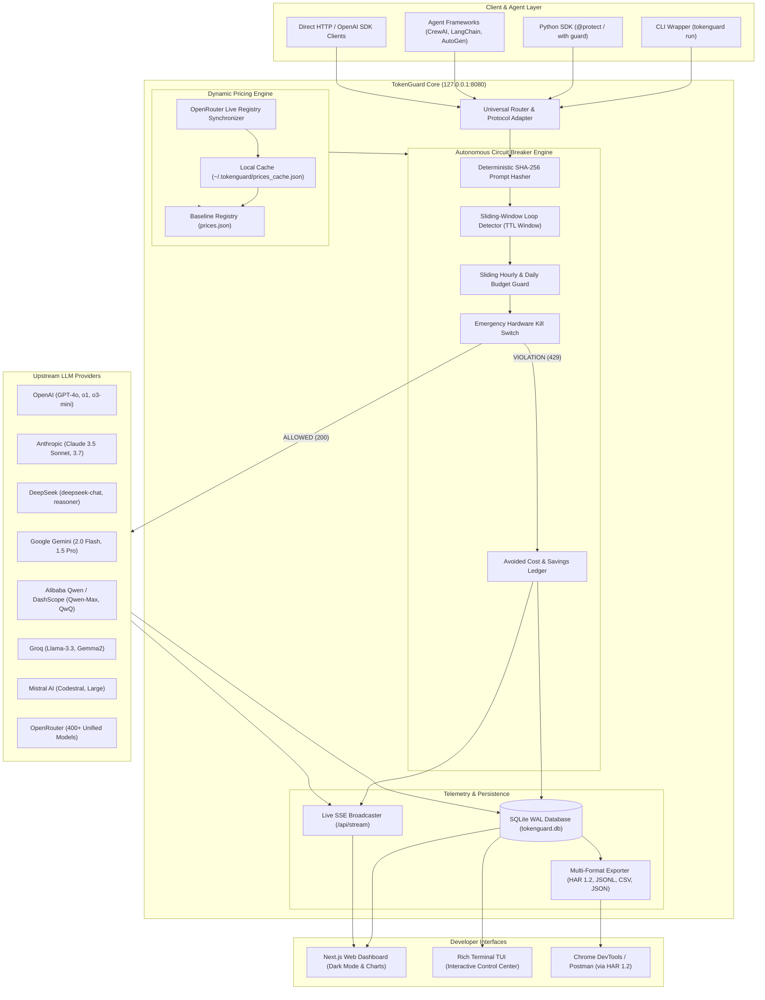
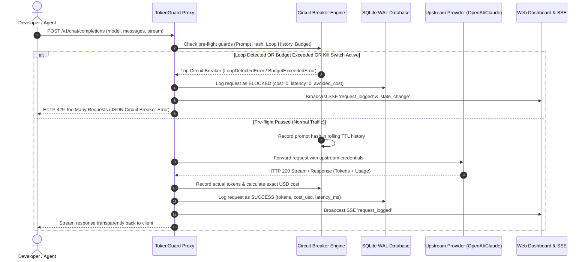
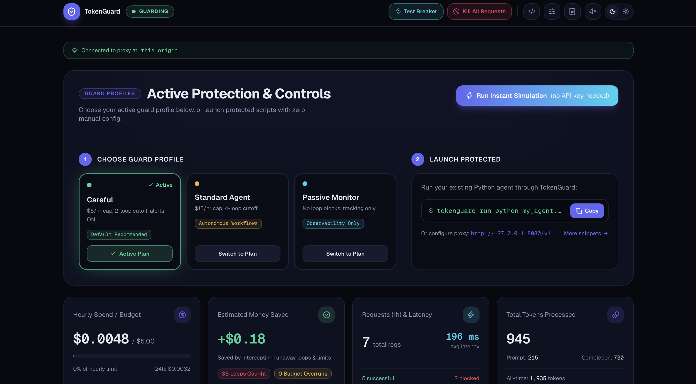
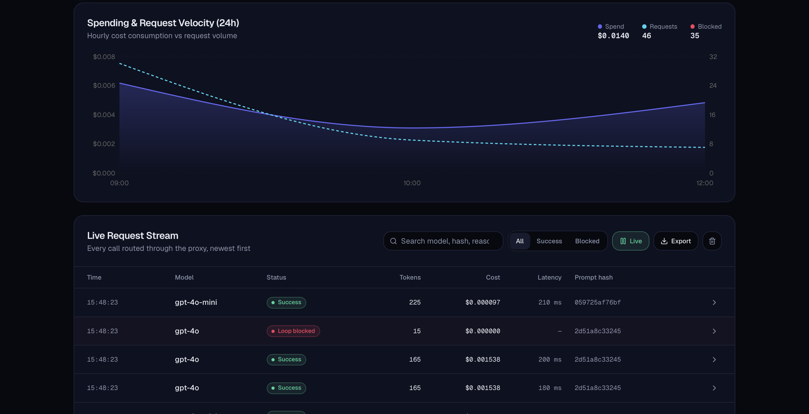
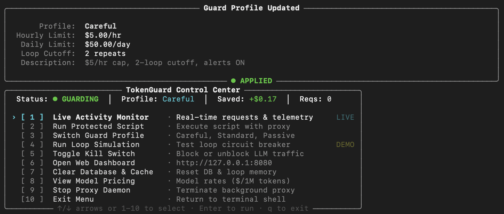
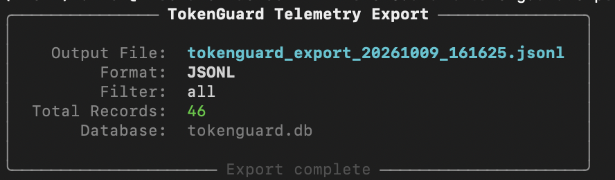

# TokenGuard 🛡️

### Zero-trust local circuit breaker and real-time telemetry proxy for autonomous LLM agents

[](https://python.org)
[](https://fastapi.tiangolo.com)
[](https://sqlite.org)
[](https://github.com/Textualize/rich)
[](#supported-providers)
[](https://opensource.org/licenses/MIT)
[](.github/workflows/ci.yml)

---

## 📑 Table of contents

- [Overview](#-overview)
- [System Architecture](#-system-architecture)
  - [High-Level Architecture Diagram](#high-level-architecture-diagram)
  - [Request Lifecycle Sequence](#request-lifecycle-sequence)
- [Visual Showcase](#-visual-showcase)
- [Screenshot Guide & Assets Checklist](#-screenshot-guide--assets-checklist)
- [Core Features & Technical Deep Dive](#-core-features--technical-deep-dive)
  - [1. Infinite Loop Circuit Breaker](#1-infinite-loop-circuit-breaker)
  - [2. Budget Limiter & Avoided Cost Ledger](#2-budget-limiter--avoided-cost-ledger)
  - [3. Dynamic Real-Time Pricing Synchronizer](#3-dynamic-real-time-pricing-synchronizer)
  - [4. Multi-Format Telemetry Exporter](#4-multi-format-telemetry-exporter)
  - [5. Zero-Friction Python SDK](#5-zero-friction-python-sdk)
  - [6. High-End Developer CLI & Web Dashboard](#6-high-end-developer-cli--web-dashboard)
- [Installation & Quickstart](#-installation--quickstart)
- [Complete CLI Command Reference](#-complete-cli-command-reference)
  - [1. `tokenguard start`](#1-tokenguard-start)
  - [2. `tokenguard stop`](#2-tokenguard-stop)
  - [3. `tokenguard status`](#3-tokenguard-status)
  - [4. `tokenguard run`](#4-tokenguard-run)
  - [5. `tokenguard export`](#5-tokenguard-export)
  - [6. `tokenguard prices`](#6-tokenguard-prices)
  - [7. `tokenguard quickstart`](#7-tokenguard-quickstart)
  - [Interactive TUI Navigation](#interactive-tui-navigation)
- [Python SDK Guide & Code Recipes](#-python-sdk-guide--code-recipes)
  - [Function Decorator (`@protect`)](#function-decorator-protect)
  - [Context Manager (`with guard():`)](#context-manager-with-guard)
  - [Framework Integrations (LangChain, CrewAI, AutoGen, OpenAI)](#framework-integrations)
- [REST API Reference](#-rest-api-reference)
- [Model Pricing Matrix](#-model-pricing-matrix)
- [Automated Testing & CI](#-automated-testing--ci)
- [Contributing & License](#-contributing--license)

---

## 📋 Overview

Autonomous LLM agents (e.g. AutoGPT, CrewAI, LangGraph, Cursor background tasks, reasoning loops) frequently get trapped in **recursive prompt loops**, repeating identical tool calls or queries hundreds of times in seconds. Without guardrails, this can consume hundreds or thousands of dollars in API credits within minutes.

**TokenGuard** is an open-source, ultra-low latency **local proxy and circuit breaker sidecar** designed to protect your API budget and monitor LLM traffic with zero code friction.

```
                  ┌─────────────────────────────────────────────────────────┐
                  │                 YOUR APPLICATION / AGENT                │
                  │   (OpenAI SDK / Anthropic SDK / LangChain / CLI / SDK)   │
                  └────────────────────────────┬────────────────────────────┘
                                               │
                                               ▼
                  ┌─────────────────────────────────────────────────────────┐
                  │                   TOKENGUARD PROXY                      │
                  │                 http://127.0.0.1:8080                   │
                  │                                                         │
                  │  ● SHA-256 Prompt Hashing      ● Real-Time Budget Cap   │
                  │  ● Sliding Window Loop Check   ● Avoided Cost Ledger    │
                  │  ● Live OpenRouter Pricing     ● SQLite WAL Telemetry   │
                  └────────────┬───────────────────────────────┬────────────┘
                               │                               │
                      [Allowed Requests]               [Blocked Violations]
                               │                               │
                               ▼                               ▼
                 ┌───────────────────────────┐   ┌───────────────────────────┐
                 │    UPSTREAM LLM PROVIDERS │   │   INSTANT 429 SHUTOFF     │
                 │   OpenAI, Claude, DeepSeek│   │  No upstream token cost   │
                 │   Gemini, Qwen, Mistral   │   │  Avoided cost accounted   │
                 └───────────────────────────┘   └───────────────────────────┘
```

### Why TokenGuard?

- **Zero-latency in-Memory guardrails**: Sub-millisecond pre-flight checks using sliding-window prompt hashing and sliding expenditure counters.
- **Drop-in compatibility**: Universal OpenAI-compatible `/v1/chat/completions` endpoint, native Anthropic `/v1/messages` endpoint, and Claude OpenAI adapter.
- **Never breaks future prompts**: Loop rejections never poison future requests; sending a distinct prompt immediately succeeds without false positives.
- **Live dynamic pricing**: Syncs token rates directly with OpenRouter's live registry with offline caching and instant failover.
- **Enterprise-grade telemetry**: Query telemetry in non-blocking SQLite WAL mode and export to **HAR 1.2** (Chrome DevTools / Postman compatible with custom `_tokenCost` annotations), **JSONL**, **JSON**, and **CSV**.
- **Dual developer experience**: Includes a sleek dark-mode Web Dashboard with live Server-Sent Events (SSE) and a minimal, keyboard-driven Stripe-styled Terminal TUI.

---

## 🏗️ System architecture

### High-level architecture diagram



---

### Request lifecycle sequence



---

## 📸 Visual showcase

| Screenshot | Description & visual capabilities |
| :--- | :--- |
|  | **Real-time control center**: Live metrics, active profile, hourly spend against budget limits, avoided savings tracker, and status indicators. |
|  | **Audit and telemetry ledger**: Complete request log with per-call tokens, exact model pricing, latency in ms, prompt hash, and blocked reasons. |
|  | **Developer CLI interface**: Stripe/GitHub CLI aesthetic featuring arrow navigation, zero emoji clutter, and fixed-column alignment. |
|  | **Enterprise telemetry export**: HAR 1.2 (Postman/Chrome DevTools compatible with `_tokenCost`), JSONL, JSON, and CSV downloads. |

---

## 🖼️ Screenshot guide & assets checklist

All screenshots are stored in the [`assets/images/`](assets/images/) directory. If you are updating, taking new screenshots, or contributing visuals, follow this checklist:

| Asset File | Target View to Capture | Recommended Setup & Data State |
| :--- | :--- | :--- |
| [`01_dashboard_overview.png`](assets/images/01_dashboard_overview.png) | Full web dashboard landing page at `http://127.0.0.1:8080`. | Capture with dark mode enabled, after generating at least 5-10 requests so metric cards show non-zero spend and savings. |
| [`02_live_metrics_table.png`](assets/images/02_live_metrics_table.png) | Request log table focused on the status badges (`SUCCESS`, `BLOCKED LOOP`, `BLOCKED BUDGET`). | Show a mix of successful completions and blocked loop intercepts with token counts and latency numbers. |
| [`03_stream_and_charts.png`](assets/images/03_stream_and_charts.png) | Right sidebar showing the live SSE event ticker and the hourly spending graph. | Trigger a few requests in real time to capture live pulsing event dots and chart bars. |
| [`04_simulation_suite.png`](assets/images/04_simulation_suite.png) | "Simulate" modal dialog after running a 3-step loop detection test. | Show the modal showing Attempt #1 (allowed), Attempt #2 (allowed), Attempt #3 (blocked with 429). |
| [`05_cli_control_center.png`](assets/images/05_cli_control_center.png) | Interactive CLI TUI launched via `tokenguard` (no arguments). | Capture terminal window (80+ columns) showing the menu, selected arrow pointer `›`, and active status panel. |
| [`06_telemetry_export.png`](assets/images/06_telemetry_export.png) | Postman or Chrome DevTools Network panel importing `tokenguard_export.har`. | Show custom `_tokenCost` and `_blockedReason` fields visible inside the HAR inspector. |

---

## ⚡ Core features & technical deep dive

### 1. Infinite loop circuit breaker
- **Deterministic hashing**: Computes SHA-256 hashes of normalized message arrays.
- **Sliding-window matching**: Compares the incoming prompt against the last $N$ requests inside a rolling time window (default: 60s).
- **Non-poisoning architecture**: When an identical prompt is blocked with `429 Too Many Requests`, the rejection is **not** appended to the rolling window. As a result, when the agent fixes its state and sends a distinct prompt, it succeeds immediately.

### 2. Budget limiter and avoided cost ledger
- **Dual sliding windows**: Monitors both sliding 1-hour and 24-hour spending totals against configurable caps (e.g. `--limit 5.0` for \$5/hr).
- **Avoided cost calculation**: When a request is blocked, TokenGuard calculates how much money was saved based on the model's token rate, prompt size, and an estimated 500 completion tokens.
- **Audio and desktop notifications**: Fires a non-blocking background notification (macOS AppleScript / Linux `notify-send`) and audible terminal bell when a runaway loop is intercepted.

### 3. Dynamic real-time pricing synchronizer
- **OpenRouter Live Registry**: Automatically fetches the latest pricing tables for over 400 models from `openrouter.ai/api/v1/models` without requiring an API key.
- **Local TTL caching**: Saves cached rates to `~/.tokenguard/prices_cache.json` with a 24-hour TTL.
- **Offline-first fallback**: If internet connectivity is down, it instantly falls back to the embedded [`tokenguard/prices.json`](tokenguard/prices.json) baseline.

### 4. Multi-format telemetry exporter
- **HAR 1.2 standard**: Exports valid HTTP Archive 1.2 files compatible with Chrome DevTools, Postman, and Charles Proxy, enriched with custom `_tokenCost`, `_promptTokens`, `_completionTokens`, and `_blockedReason` fields.
- **JSONL and CSV**: Fast newline-delimited JSON and standard CSV streams for downstream data pipelines, Pandas, and SIEM logging.
- **Non-blocking WAL queries**: Reads from SQLite with `PRAGMA query_only = ON;` and `PRAGMA synchronous = NORMAL;`, ensuring zero lock contention with active proxy writers.

### 5. Zero-friction Python SDK
- **Function decorator (`@tokenguard.protect`)**: Protects synchronous or asynchronous functions with automatic proxy routing.
- **Context manager (`with tokenguard.guard():`)**: Sets environment variables (`OPENAI_BASE_URL`, `ANTHROPIC_BASE_URL`, `DEEPSEEK_BASE_URL`, etc.) within the scope and safely restores them on exit or exceptions.
- **Daemon auto-start**: Automatically starts the TokenGuard background daemon if it is not currently running.

### 6. High-end developer CLI & web dashboard
- **CLI TUI**: Built with Rich, featuring clean ASCII glyphs (`›`, `·`, `●`), zero-emoji clutter, and rock-solid column alignment that never wraps on 80-column terminals.
- **Next.js web dashboard**: Dark-mode interface with live SSE updates, distribution charts, quickstart simulations, and interactive configuration controls.

---

## Installation and Quickstart

### Prerequisites
- Python 3.10, 3.11, or 3.12
- macOS or Linux (Windows supported via WSL)

### 1. Installation

```bash
# Clone repository
git clone https://github.com/Shvirlok/TokenGuard.git
cd TokenGuard

# Create and activate virtual environment
python3 -m venv .venv
source .venv/bin/activate

# Install in editable mode with development dependencies
pip install -e ".[dev]"
```

### 2. Configure API keys
TokenGuard detects keys automatically from your environment, `.env` file, or stored config:

```bash
export OPENAI_API_KEY="sk-..."
export ANTHROPIC_API_KEY="sk-ant-..."
export DEEPSEEK_API_KEY="sk-..."
```

### 3. Launch TokenGuard

```bash
# Start TokenGuard in background daemon mode
tokenguard start -d

# Open interactive Control Center TUI
tokenguard

# Open Web Dashboard in browser
open http://127.0.0.1:8080
```

---

## 💻 Complete CLI command reference

TokenGuard provides a full suite of CLI commands for server management, script wrapping, telemetry export, and live pricing updates.

```
usage: tokenguard [-h] {start,stop,status,run,export,prices,quickstart} ...
```

---

### 1. `tokenguard start`
Start the TokenGuard proxy server and dashboard.

```bash
tokenguard start [options]
```

| Flag / Option | Type | Default | Description |
| :--- | :--- | :--- | :--- |
| `-d`, `--daemon` | Flag | `False` | Run TokenGuard as a background daemon process. |
| `--host` | `str` | `127.0.0.1` | Network interface to bind the proxy server to. |
| `--port` | `int` | `8080` | Port for the proxy server and dashboard. |
| `--limit` | `float` | `5.0` | Sliding hourly budget limit in USD. |
| `--daily-limit` | `float` | `50.0` | Sliding daily budget limit in USD. |
| `--max-repeats` | `int` | `3` | Maximum identical consecutive requests before tripping (alias for `--loop-threshold`). |
| `--loop-window` | `float` | `60.0` | Sliding time window in seconds for consecutive loop matching. |
| `--profile` | `str` | `careful` | Preset profile: `careful` (\$5/hr, 2 loops), `standard` (\$15/hr, 4 loops), `passive`. |
| `--passive` | Flag | `False` | Run in passive observability mode (no loop or budget cutoffs). |

**Examples:**
```bash
# Start in background with strict $2/hr limit and 2-loop cutoff
tokenguard start -d --limit 2.0 --max-repeats 2

# Start in passive monitoring mode on custom port
tokenguard start -d --port 9090 --passive
```

---

### 2. `tokenguard stop`
Stop any active background TokenGuard daemon process.

```bash
tokenguard stop [--port 8080]
```

---

### 3. `tokenguard status`
Display real-time health, daemon PID, hourly spend, avoided savings, and active API key status.

```bash
tokenguard status
```

**Output Preview:**
```text
╭───────────────────────────── TokenGuard Status ──────────────────────────────╮
│                                                                              │
│          Status:  ● ACTIVE & GUARDING                                        │
│  Proxy Base URL:  http://127.0.0.1:8080/v1                                   │
│  Live Dashboard:  http://127.0.0.1:8080                                      │
│      Daemon PID:  58871                                                      │
│  Active Profile:  Careful                                                    │
│    Hourly Spend:  $0.0016 / $5.00                                            │
│     Money Saved:  +$0.1713                                                   │
│        Requests:  7 (5 ok, 2 blocked)                                        │
│     Keys Active:  OpenAI (sk-7••••c530)                                      │
│                                                                              │
╰──────────────────────────────────────────────────────────────────────────────╯
```

---

### 4. `tokenguard run`
Execute any command or script with `OPENAI_BASE_URL`, `OPENAI_API_BASE`, and `ANTHROPIC_BASE_URL` automatically injected into the subprocess environment.

```bash
tokenguard run [options] -- <command> [args...]
```

| Option | Type | Default | Description |
| :--- | :--- | :--- | :--- |
| `--port` | `int` | `8080` | Proxy port to route traffic through. |
| `--limit` | `float` | `5.0` | Hourly budget limit for this run. |
| `--max-repeats` | `int` | `3` | Maximum loop repeats before blocking. |
| `--passive` | Flag | `False` | Run in non-blocking observability mode. |

**Examples:**
```bash
# Protect a Python agent script
tokenguard run -- python agent.py

# Run an npm/Node.js autonomous agent
tokenguard run -- npm start

# Protect a pytest suite executing real LLM integration tests
tokenguard run --max-repeats 2 -- pytest tests/
```

---

### 5. `tokenguard export`
Export recorded request telemetry directly from SQLite in WAL mode without blocking incoming proxy writes.

```bash
tokenguard export [options]
```

| Option | Type | Default | Description |
| :--- | :--- | :--- | :--- |
| `--format` | `choice` | `jsonl` | Output format: `jsonl`, `har`, `json`, `csv`. |
| `--output` | `path` | Auto-generated | Destination file path (defaults to timestamped file). |
| `--status` | `str` | `all` | Filter by status: `all`, `success`, `blocked`. |

**Examples:**
```bash
# Export to HAR 1.2 for inspection in Chrome DevTools / Postman
tokenguard export --format har --output audit_session.har

# Export blocked loop events to JSONL
tokenguard export --format jsonl --status blocked --output blocked_loops.jsonl

# Export all metrics to CSV for Excel / Pandas analysis
tokenguard export --format csv --output telemetry.csv
```

---

### 6. `tokenguard prices`
Manage model pricing registries, sync live rates from OpenRouter, and view active token costs.

```bash
tokenguard prices [options]
```

| Option | Type | Default | Description |
| :--- | :--- | :--- | :--- |
| `--update` | Flag | `False` | Force fetch live model pricing registry from OpenRouter public API. |
| `--offline` | Flag | `False` | Display local offline baseline prices from `prices.json`. |
| `--export` | `path` | `None` | Export active pricing table to a JSON file. |

**Examples:**
```bash
# Sync live rates for 400+ models from OpenRouter
tokenguard prices --update

# View offline baseline rates
tokenguard prices --offline
```

---

### 7. `tokenguard quickstart`
Interactive setup wizard to detect API keys, configure guard profiles, and launch the proxy.

```bash
tokenguard quickstart
```

---

### Interactive CLI navigation

Running `tokenguard` without arguments opens the full interactive terminal console:

```bash
tokenguard
```

- **Navigation**: Use <kbd>↑</kbd> and <kbd>↓</kbd> arrow keys to navigate menu items.
- **Selection**: Press <kbd>Enter</kbd> to execute the highlighted action.
- **Direct access**: Type numbers <kbd>1</kbd> through <kbd>10</kbd> or press <kbd>q</kbd> to quit.

---

## Python SDK guide and code recipes

TokenGuard includes a zero-friction Python SDK allowing direct in-code protection of LLM calls without modifying base URLs manually.

### Function decorator (`@protect`)

Use `@tokenguard.protect` on synchronous or asynchronous functions:

```python
import tokenguard
from openai import OpenAI

# Protect sync function
@tokenguard.protect(max_repeats=3, budget_limit=10.0)
def generate_summary(text: str) -> str:
    client = OpenAI()
    response = client.chat.completions.create(
        model="gpt-4o",
        messages=[{"role": "user", "content": f"Summarize: {text}"}],
    )
    return response.choices[0].message.content

# Protect async function
@tokenguard.protect(max_repeats=2)
async def ask_agent_async(prompt: str) -> str:
    client = OpenAI()
    response = client.chat.completions.create(
        model="deepseek-chat",
        messages=[{"role": "user", "content": prompt}],
    )
    return response.choices[0].message.content
```

---

### Context manager (`with guard():`)

Scope protection to specific code blocks:

```python
import tokenguard
from openai import OpenAI

client = OpenAI()

# Standard synchronous block
with tokenguard.guard(max_repeats=3, budget_limit=5.0):
    response = client.chat.completions.create(
        model="gpt-4o-mini",
        messages=[{"role": "user", "content": "Execute agent step"}],
    )
    print(response.choices[0].message.content)
```

---

### Framework integrations

#### 1. Native Anthropic messages API
TokenGuard automatically intercepts both Anthropic native format and OpenAI Claude calls:

```python
import tokenguard
import anthropic

client = anthropic.Anthropic()

with tokenguard.guard(max_repeats=3):
    message = client.messages.create(
        model="claude-3-5-sonnet-20241022",
        max_tokens=1024,
        messages=[{"role": "user", "content": "Analyze system logs"}],
    )
    print(message.content[0].text)
```

#### 2. LangChain & LangGraph
```python
import tokenguard
from langchain_openai import ChatOpenAI

with tokenguard.guard(max_repeats=3):
    llm = ChatOpenAI(model="gpt-4o")
    result = llm.invoke("Draft test suite for authentication module")
    print(result.content)
```

#### 3. DeepSeek direct integration
```python
import tokenguard
from openai import OpenAI

# DeepSeek routes automatically to https://api.deepseek.com
with tokenguard.guard(max_repeats=2):
    client = OpenAI()
    response = client.chat.completions.create(
        model="deepseek-reasoner",
        messages=[{"role": "user", "content": "Solve combinatorial puzzle"}],
    )
    print(response.choices[0].message.content)
```

---

## REST API reference

TokenGuard exposes standard proxy routes alongside management and streaming endpoints on port `8080`.

| Method | Endpoint | Description |
| :--- | :--- | :--- |
| `POST` | `/v1/chat/completions` | Universal OpenAI-compatible chat proxy with circuit breaker and auto-routing. |
| `POST` | `/v1/messages` | Native Anthropic Messages API proxy with loop and budget protection. |
| `GET` | `/v1/models` | List available models across all registered providers. |
| `POST` | `/v1/embeddings` | Embeddings proxy with token cost calculation and loop checks. |
| `GET` | `/health` | Server health check and active kill switch status. |
| `GET` | `/api/stats` | Aggregated metrics, sliding spend, avoided cost savings, and breaker health. |
| `GET` | `/api/requests` | Paginated request logs with status, tokens, latency, and costs. |
| `GET` | `/api/export` | Export telemetry stream (`?format=har|jsonl|json|csv&status=all|blocked`). |
| `GET` | `/api/history` | Hourly spend and request breakdown for chart rendering. |
| `GET` | `/api/stream` | Server-Sent Events (SSE) live event ticker. |
| `POST` | `/api/kill-switch` | Toggle or set emergency kill switch state (`{"active": true/false}`). |
| `POST` | `/api/config` | Dynamically update budget limits, loop threshold, and active profile. |
| `POST` | `/api/simulate` | Trigger simulated loop or success events for onboarding validation. |
| `POST` | `/api/clear-logs` | Wipe SQLite request logs and reset in-memory counters. |

---

## Model pricing matrix

TokenGuard maintains a built-in pricing registry (USD per 1,000,000 tokens) updated in real time via OpenRouter:

| Model Identifier | Provider | Input Rate ($/1M) | Output Rate ($/1M) | Auto-Detected Prefix |
| :--- | :--- | :---: | :---: | :--- |
| `gpt-4o` | OpenAI | \$2.50 | \$10.00 | `gpt-4o*` |
| `gpt-4o-mini` | OpenAI | \$0.15 | \$0.60 | `gpt-4o-mini*` |
| `o1` | OpenAI | \$15.00 | \$60.00 | `o1*` |
| `o3-mini` | OpenAI | \$1.10 | \$4.40 | `o3-mini*` |
| `claude-3-5-sonnet` | Anthropic | \$3.00 | \$15.00 | `claude-3-5-sonnet*` |
| `claude-3-7-sonnet` | Anthropic | \$3.00 | \$15.00 | `claude-3-7-sonnet*` |
| `claude-3-haiku` | Anthropic | \$0.25 | \$1.25 | `claude-3-haiku*` |
| `deepseek-chat` | DeepSeek | \$0.14 | \$0.28 | `deepseek-chat*` |
| `deepseek-reasoner` | DeepSeek | \$0.55 | \$2.19 | `deepseek-reasoner*` |
| `gemini-2.0-flash` | Google | \$0.10 | \$0.40 | `gemini-2.0-flash*` |
| `gemini-1.5-pro` | Google | \$1.25 | \$5.00 | `gemini-1.5-pro*` |
| `qwen-max` | Alibaba | \$2.80 | \$8.40 | `qwen-max*` |
| `qwen-2.5-coder` | Alibaba | \$0.20 | \$0.60 | `qwen-2.5-coder*` |
| `llama-3.3-70b` | Meta / Groq | \$0.59 | \$0.79 | `llama-3.3-70b*` |
| `codestral` | Mistral | \$0.30 | \$0.90 | `codestral*` |
| `default` | Fallback | \$1.00 | \$2.00 | Unrecognized models |

*Run `tokenguard prices --update` to refresh rates directly from OpenRouter.*

---

## Automated testing and CI

TokenGuard is covered by a test suite executed against multi-OS environments on GitHub Actions.

```bash
# Run complete test suite with verbose output
pytest -v

# Run tests with short summary
pytest -q

# Run specific test suites
pytest tests/test_guard.py tests/test_sdk.py tests/test_export.py
```

### GitHub Actions Workflow Matrix
- **OS Matrix**: `ubuntu-latest`, `macos-latest`
- **Python Matrix**: `3.10`, `3.11`, `3.12`
- **Verification**: Zero regression test passes, SQLite WAL isolation, dynamic price sync resilience, and SDK environment restoration.

---

## Contributing and license

Contributions are welcome! Please submit issues, feature proposals, and pull requests via GitHub.

This project is licensed under the **MIT License** &mdash; see the [`LICENSE`](LICENSE) file for details.

---

<p align="center">
  <b>TokenGuard</b> &bull; Built with FastAPI, Rich, and SQLite WAL for resilient AI agent engineering.
</p>
